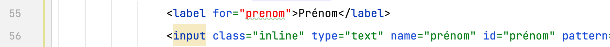
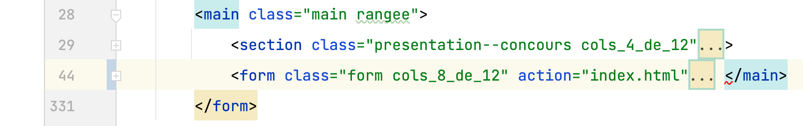
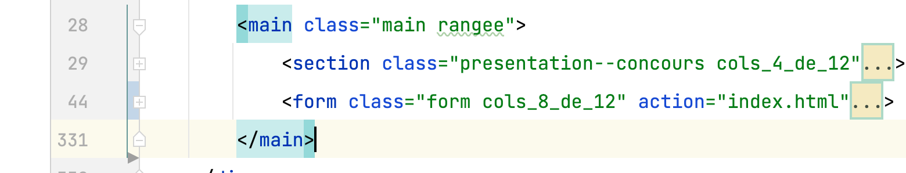

# Grille d'évaluation pour le TP3
## Structure, sémantique, accessibilité, API des formulaires HTML5
- [X] __Regrouper les éléments de formulaire de même nature__ (.85/1 point)
    - Utiliser des `<fieldsets>`
    - Faire des groupes d’`<option>`s dans une liste déroulante
- [X] __Étiqueter__ (0.75/1 point)
    - Étiqueter les groupes d’éléments de formulaire
    - Nommer chaque groupe avec une `<legend>`
    - Étiqueter un groupe d’`<option>`s d’une liste déroulante
    - Étiqueter avec un `<label>` les champs de formulaire
- [X] __Tester l'accessibilité__ (0.75/1 point)
    - Rendre (garder) le formulaire navigable au clavier
    - Baliser avec précision les éléments de formulaire
    - Bien choisir le type du `<input>`
    - Code sémantique et valide pour l’ensemble du document
- [X] __Ajouter des containtes de saisie__ (.9/1 point)
    - Identifier par un attribut approprié les champs obligatoires du formulaire
    - Ajouter des contraintes de saisie sur les champs de formulaire

## Styles CSS
- [X] __Aligner les éléments de formulaire__ (.85/1 point)
    - Contrôler les espacements
- [X] __Intégrer tous les contenus__  (.9/1 point)
    - Selon les guides visuels (ou mieux !)
- [X] __Styler l’interactivité__  (.85/1 point)
    - État focus, état checked des éléments de formulaires
    - États des hyperliens (link, visited, hover, active)
    - Styler les messages d’erreur
    - Utiliser des sprites CSS
- [X] __Styler les boutons radio__  (1 point)
    - en les gardant accessibles au clavier

## Méthodes de travail favorisant la collaboration
- [X] __Organiser et documenter la feuille de styles__  (1 point)
- [X] __Utiliser le contrôle des versions GIT__  (1 point)
    - Un minimum de 3 commits est attendu pour les étapes html, css, contrôle qualité finale

## Note et commentaires
 8.85 / 10 

### html et accessibilité
- Il y a plusieurs [erreurs html](images/erreurs-html.pdf)
La plupart de ces erreurs semblent accidentelles ce qui confirme l'importance d'utiliser le validateur du w3c pour les identifier et les corriger.

- Dans un cas, l'étiquette n'est pas correctement reliée à son champ de saisie:

- Les regroupements d'options dans les listes déroulantes ne sont pas bien intégrés. 
La balise fermante `</optgroup>` doit se trouver après les `<option>` du groupe. 

- Ici, ce sont les emboîtements qui ne sont pas dans le bon ordre:

Une fois corrigés:

### Fonctionnalités
- Un problème plus grave est observé au niveau des boutons radio. 
La valeur de leur name n'est pas la même. Hors, une valeur de `name` identique est essentielle pour créer le comportement mutuellement exclusif des boutons radio. Voir dans le code du commit.
- D'autres contraintes pourraient être ajoutées sur les éléments de formulaire
  - Sur les champs de saisie de jour et d'année des attributs min empêcheront la flèche vers le bas d'aller dans les valeurs négatives.
  - Sur le champ de saisie de jour, un attribut max="31"

## Barème
| Barème | sur 1 |
|--------|-------|
| A+     | 1     |
| A      | 0.95  |
| B+     | 0.9   |
| B      | 0.85  |
| C+     | 0.8   |
| C      | 0.75  |
| D      | 0.65  |
